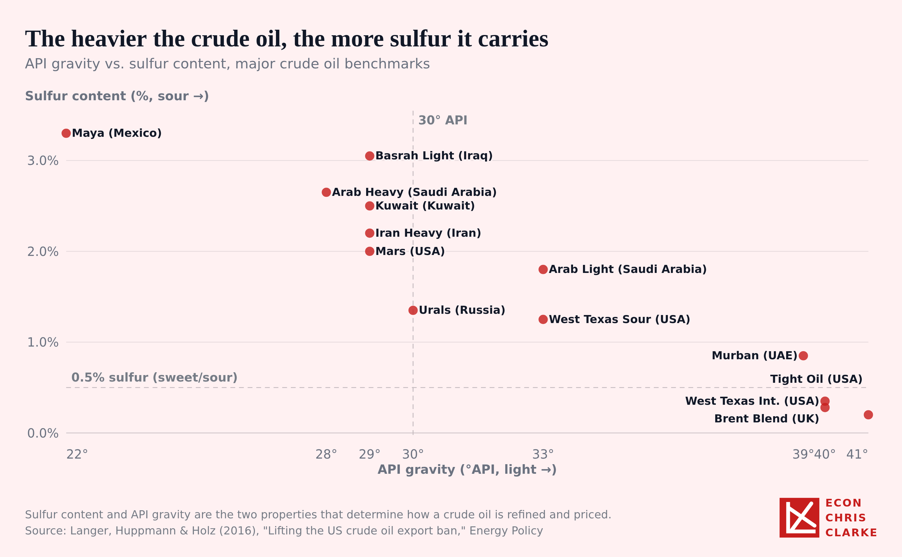

# OilMarkets

Charts and data on global crude oil markets.

## Charts

**Live pages** (GitHub Pages, `https://econchrisclarke.github.io/OilMarkets/`):

| # | Chart | Live page |
|---|---|---|
| 1 | The US exports 1.2 million barrels of diesel a day, mostly from the Gulf | [diesel-exports-2024.html](https://econchrisclarke.github.io/OilMarkets/diesel-exports-2024.html) |
| 2 | Most US diesel imports are Canadian fuel landing in New England | [diesel-imports-2024.html](https://econchrisclarke.github.io/OilMarkets/diesel-imports-2024.html) |
| 3 | The Gulf Coast sends more diesel abroad than to the rest of the US | [gulf-diesel-2024.html](https://econchrisclarke.github.io/OilMarkets/gulf-diesel-2024.html) |
| 4 | Post-Covid fuel price shocks come from refining limits more than crude, unlike 2008 | [diesel-gasoline-margins.html](https://econchrisclarke.github.io/OilMarkets/diesel-gasoline-margins.html) |

### US diesel exports by port region and destination, 2024

The US exported 1.19 million barrels a day of distillate fuel oil (diesel and
heating oil) in 2024, mostly from Texas and Louisiana/Mississippi ports.
About half went to Latin America, a quarter to Europe and a fifth to Mexico.
Arrow width is barrels per day.

- **View the map:** [diesel-exports-2024.html](https://econchrisclarke.github.io/OilMarkets/diesel-exports-2024.html)
  (Substack, vertical and square frames; hover for flow details; PNG export button)
- **Data:** [`data/census_trade/distillate_exports_by_district_2024.csv`](data/census_trade/distillate_exports_by_district_2024.csv)
  (exports), [`data/census_trade/distillate_imports_by_district_2024.csv`](data/census_trade/distillate_imports_by_district_2024.csv) (imports)
- **Map config:** [`maps/configs/diesel-exports-2024.json`](maps/configs/diesel-exports-2024.json),
  built by [`scripts/process_distillate_2024.py`](scripts/process_distillate_2024.py) and
  [`maps/build_map.js`](maps/build_map.js) (see [`maps/README.md`](maps/README.md))

**Source:** US Census Bureau, International Trade API, exports by customs
district at the HS10 level (Schedule B 2710.19.1106/1109/1112 and 2710.20).

### Crude oil vs. diesel and gasoline refining margins, 2006-2026

Brent crude, and what a barrel of diesel and a barrel of gasoline fetch over the Brent crude
they are made from, at US Gulf Coast spot prices, monthly. In 2010-19 the
margins averaged $14 (diesel) and $8 (gasoline) a barrel. Diesel's hit $73
in October 2022 and a record $86 in August 2026; gasoline's reached a record
$54 in July 2026. The contrast with 2008 is the point: Brent peaked at $133 in
July 2008 with a diesel margin of $28, while in August 2026 Brent was $91 and
the diesel margin $86. Prices are nominal.

- **View the chart:** [diesel-gasoline-margins.html](https://econchrisclarke.github.io/OilMarkets/diesel-gasoline-margins.html)
- **Data:** [`data/eia/gulf_crack_spreads_monthly.csv`](data/eia/gulf_crack_spreads_monthly.csv)
- **Chart config:** [`charts/diesel-gasoline-margins.json`](charts/diesel-gasoline-margins.json),
  built by [`scripts/process_crack_spreads.py`](scripts/process_crack_spreads.py)

**Source:** EIA spot prices: Brent; US Gulf Coast ultra-low-sulfur No. 2 diesel;
US Gulf Coast conventional regular gasoline (monthly averages of daily closes).

### Where Gulf Coast diesel goes, 2024

The Gulf Coast (PADD 3) sent 1.04 million barrels a day of distillate fuel
oil abroad in 2024, against 0.97 million to the rest of the US. Almost all of
the domestic flow went to the East Coast (868k b/d, 85% by pipeline). The
Midwest took 62k b/d, and the West 34k b/d, all of it by pipeline to Arizona:
no Gulf diesel went to the West Coast by ship. Same arrow scale as the export
and import maps.

- **View the map:** [gulf-diesel-2024.html](https://econchrisclarke.github.io/OilMarkets/gulf-diesel-2024.html)
- **Data:** [`data/eia/distillate_padd3_outflows_2020_2025.csv`](data/eia/distillate_padd3_outflows_2020_2025.csv)
  (movements to other regions by mode, 2020-2025),
  [`data/census_trade/distillate_exports_padd3_by_region_2024.csv`](data/census_trade/distillate_exports_padd3_by_region_2024.csv) (exports)
- **Map config:** [`maps/configs/gulf-diesel-2024.json`](maps/configs/gulf-diesel-2024.json),
  built by [`scripts/process_gulf_diesel_2024.py`](scripts/process_gulf_diesel_2024.py)

**Source:** EIA, Movements by Pipeline, Tanker, Barge and Rail between PAD
Districts (annual); US Census Bureau, International Trade API, exports by
customs district (HS10) from the Houston-Galveston, Port Arthur, New Orleans,
Mobile, Laredo and El Paso districts.

### US diesel imports by state of entry and origin, 2024

The US imported 168,000 barrels a day of distillate fuel oil in 2024, about a
seventh of what it exported. Canada supplied 88% of it, and 59% came in
through New England: Massachusetts (47k b/d), Maine (38k b/d), Rhode Island
and Vermont. Puerto Rico (20k b/d, mostly from Colombia) was the next largest.
"State" is where the diesel cleared customs (the customs district's state),
not where it was used. Arrow width is barrels per day.

- **View the map:** [diesel-imports-2024.html](https://econchrisclarke.github.io/OilMarkets/diesel-imports-2024.html)
- **Data:** [`data/census_trade/distillate_imports_by_state_2024.csv`](data/census_trade/distillate_imports_by_state_2024.csv)
- **Map config:** [`maps/configs/diesel-imports-2024.json`](maps/configs/diesel-imports-2024.json),
  built by [`scripts/process_distillate_imports_2024.py`](scripts/process_distillate_imports_2024.py)

**Source:** US Census Bureau, International Trade API, imports by customs
district at the HS10 level (the same distillate codes as the export map).

### Crude oil sulfur content vs. API gravity

The heavier a crude oil, the more sulfur it tends to carry. This chart plots
API gravity (a measure of density — higher is lighter) against sulfur
content for major crude oil benchmarks traded worldwide.

- **View the chart:** [Open interactive chart](https://htmlpreview.github.io/?https://raw.githubusercontent.com/EconChrisClarke/OilMarkets/main/charts/crude-oil-sulfur-api.html)
  (renders in-browser; includes a PNG export button)
- **Data:** [`data/crude_oil_sulfur_api.csv`](data/crude_oil_sulfur_api.csv)
- **Chart source config:** [`charts/crude-oil-sulfur-api.json`](charts/crude-oil-sulfur-api.json)
- **Static image:** [`images/crude-oil-sulfur-api.png`](images/crude-oil-sulfur-api.png)

**Source:** Langer, Huppmann & Holz (2016), "Lifting the US crude oil export
ban," *Energy Policy*.
